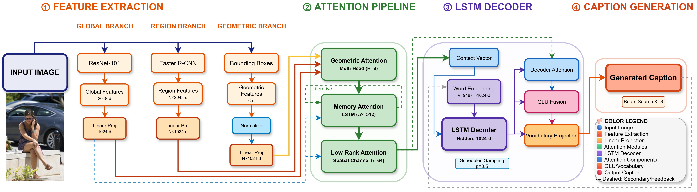

# SAIC: Spatially Aware Image Captioning

Official implementation for the published article:

**SAIC: A spatially aware image captioning framework integrating visual and geometric features**  
Mohammad Alamgir Hossain, Md. Bipul Hossen, ZhongFu Ye, Md. Atiqur Rahman, Md. Shohidul Islam, Md. Ibrahim Abdullah  
*Applied Soft Computing*, Volume 201, 2026, Article 115662  
DOI: [10.1016/j.asoc.2026.115662](https://doi.org/10.1016/j.asoc.2026.115662)  
ScienceDirect: <https://www.sciencedirect.com/science/article/abs/pii/S1568494626011105>

SAIC is a supervised image captioning framework that integrates **ResNet-101 global visual features**, **pre-extracted Faster R-CNN region features**, and **projected object-level geometric cues** before LSTM-based caption generation. The model uses a sequential encoder-side fusion pipeline consisting of geometric attention, memory-enhanced attention, and low-rank spatial-channel refinement.

<p align="center">
  
</p>

> **Note.** SAIC uses object-level geometric descriptors derived from individual bounding boxes. It does not construct an explicit pairwise object-object relation graph or pairwise geometric-relation tensor.

---

## Highlights

- Spatially Aware Image Captioning (SAIC) framework for structured multimodal fusion.
- Combines **CNN/ResNet-101 global features** and **Faster R-CNN region features** for scene-level and object-level modeling.
- Extracts object-level geometric cues from bounding boxes using coordinates, size, aspect ratio, and area.
- Uses a **Geometric Attention Mechanism** to fuse visual features with projected geometric cues.
- Uses **Dot-Product Attention with Memory Enhancement** and **Low-Rank Attention with Spatial-Channel Refinement** before LSTM decoding.
- Trained and evaluated on **MS COCO 2014** using the Karpathy split.

---

## Model overview

SAIC follows a multibranch feature extraction and fusion pipeline:

1. **Global branch**  
   ResNet-101 extracts a 2048-dimensional global image feature, which is projected into the shared embedding space.

2. **Region branch**  
   Pre-extracted Faster R-CNN region features represent object-level visual content. In the reported configuration, region features are projected from 2048 dimensions to the shared 1024-dimensional embedding space.

3. **Geometric branch**  
   Bounding boxes are converted into a six-dimensional object-level descriptor:

   ```text
   [x, y, w, h, aspect_ratio, area]
   ```

   These geometric features are normalized and linearly projected into the same shared embedding space as the visual features.

4. **Attention pipeline**  
   The projected features are refined by:

   - Geometric Attention Mechanism
   - Dot-Product Attention with Memory Enhancement
   - Low-Rank Attention with Spatial-Channel Refinement

5. **Caption decoder**  
   The final encoder representation is decoded using an LSTM-based caption generator with attention, GLU fusion, and beam-search decoding.

---

## Dataset

The experiments are conducted on **MS COCO 2014** using the standard Karpathy split.

| Split | Images |
|---|---:|
| Training | 113,287 |
| Validation | 5,000 |
| Test | 5,000 |

Each image has five human-written captions. The reported vocabulary size is **9,487**, using a minimum token frequency threshold of five.

---

## Main results

Performance on the MS COCO Karpathy test split:

| Training stage | B@1 | B@2 | B@3 | B@4 | METEOR | ROUGE-L | CIDEr | SPICE |
|---|---:|---:|---:|---:|---:|---:|---:|---:|
| Cross-entropy | 78.9 | 63.4 | 49.6 | 38.5 | 28.7 | 58.3 | 120.9 | 21.7 |
| CIDEr-optimized / SCST | 81.4 | 66.3 | 52.1 | 40.1 | 29.4 | 59.4 | 131.4 | 23.2 |

The CIDEr-optimized checkpoint improves over the selected cross-entropy checkpoint. In the paper, paired bootstrap analysis reports statistically significant gains for BLEU-4 and CIDEr.

---

## Requirements

The original repository environment is retained for compatibility with the released codebase.

- Python 3
- CUDA 10
- numpy
- tqdm
- easydict
- [PyTorch](http://pytorch.org/) > 1.0
- [torchvision](http://pytorch.org/)
- [coco-caption](https://github.com/ruotianluo/coco-caption)

A typical environment can be prepared as follows:

```bash
conda create -n saic python=3.7 -y
conda activate saic
pip install numpy tqdm easydict torch torchvision
```

Install and configure `coco-caption` separately following its official instructions.

---

## Data preparation

1. Download the bottom-up / Faster R-CNN features from the original bottom-up attention release and convert them to `.npz` format:

   ```bash
   python2 tools/create_feats.py --infeats bottom_up_tsv --outfolder ./mscoco/feature/up_down_10_100
   ```

2. Download the MS COCO caption annotations and place them inside the `mscoco` folder. More details about the original data format can be found in [self-critical.pytorch](https://github.com/ruotianluo/self-critical.pytorch).

3. Download [coco-caption](https://github.com/ruotianluo/coco-caption) and set the path of `__C.INFERENCE.COCO_PATH` in:

   ```text
   lib/config.py
   ```

4. Download pretrained models and results:

   - Cross-entropy checkpoint / results: <https://drive.google.com/file/d/1Jf1Hy-fvb-UrWZLT2tgCDZkAondjG0wd/view?usp=drive_link>
   - Reinforcement-learning / CIDEr-optimized checkpoint / results: <https://drive.google.com/file/d/1sPTLErvToX_nnRHogBdKJw1gHp99w0Cl/view?usp=drive_link>

5. Download the pretrained SENet-154 model if required by your configuration:

   <https://drive.google.com/file/d/1CrWJcdKLPmFYVdVNcQLviwKGtAREjarR/view?usp=sharing>

---

## Training

The released repository keeps the original experiment-folder naming from the X-LAN codebase for compatibility. The SAIC model can be trained using the corresponding experiment scripts in this repository.

### Stage 1: Cross-entropy training

```bash
bash experiments/xlan/train.sh
```

### Stage 2: CIDEr optimization with self-critical sequence training

Copy the best cross-entropy pretrained model into:

```text
experiments/xlan_rl/snapshot
```

Then run:

```bash
bash experiments/xlan_rl/train.sh
```

### Optional legacy baseline scripts

The repository may also contain transformer baseline scripts inherited from the original codebase:

```bash
bash experiments/xtransformer/train.sh
bash experiments/xtransformer_rl/train.sh
```

These scripts are kept for baseline compatibility. The published SAIC article focuses on the LSTM-based SAIC framework with encoder-side global, regional, and projected geometric feature fusion.

---

## Evaluation

Evaluate a trained checkpoint with:

```bash
CUDA_VISIBLE_DEVICES=0 python3 main_test.py --folder experiments/model_folder --resume model_epoch
```

Example:

```bash
CUDA_VISIBLE_DEVICES=0 python3 main_test.py --folder experiments/xlan_rl --resume 37
```

Adjust `model_folder` and `model_epoch` according to the checkpoint location and epoch number used in your experiment.

---

## Reproducibility notes

The paper reports the following configuration for the main SAIC experiments:

| Setting | Value |
|---|---:|
| Shared embedding dimension | 1024 |
| Number of regions | 36 |
| LSTM hidden state | 1024 |
| Word embedding dimension | 1024 |
| Memory size | 512 |
| Beam width | 3 |
| Scheduled sampling probability | 0.5 |
| CE learning rate | 1e-4 |
| CIDEr optimization learning rate | 1e-5 |
| CE epochs | 74 |
| CIDEr optimization epochs | 50 |
| Hardware used in reported runs | Single NVIDIA RTX 3080 Ti |

The reported SAIC checkpoint contains about **92.001M parameters**. The paper reports wall-clock training time and end-to-end evaluation runtime for computational transparency, but does not claim a verified efficiency advantage over transformer-based captioning models.

---

## Citation

If this repository is useful for your research, please cite the published SAIC article:

```bibtex
@article{hossain2026saic,
  title   = {SAIC: A spatially aware image captioning framework integrating visual and geometric features},
  author  = {Hossain, Mohammad Alamgir and Hossen, Md. Bipul and Ye, ZhongFu and Rahman, Md. Atiqur and Islam, Md. Shohidul and Abdullah, Md. Ibrahim},
  journal = {Applied Soft Computing},
  volume  = {201},
  pages   = {115662},
  year    = {2026},
  doi     = {10.1016/j.asoc.2026.115662}
}
```

This repository builds on and adapts components from the X-Linear Attention Networks / self-critical image-captioning code ecosystem. Please also cite X-LAN where appropriate:

```bibtex
@inproceedings{xlinear2020cvpr,
  title     = {X-Linear Attention Networks for Image Captioning},
  author    = {Pan, Yingwei and Yao, Ting and Li, Yehao and Mei, Tao},
  booktitle = {Proceedings of the IEEE/CVF Conference on Computer Vision and Pattern Recognition},
  year      = {2020}
}
```

---

## Acknowledgements

This implementation retains compatibility with the original image-captioning training pipeline and acknowledges the contributions of:

- [self-critical.pytorch](https://github.com/ruotianluo/self-critical.pytorch)
- [coco-caption](https://github.com/ruotianluo/coco-caption)
- X-Linear Attention Networks for Image Captioning
- PyTorch and torchvision

The article acknowledges support from the ANSO Scholarship for Young Talents and the University of Science and Technology of China, with additional support from Islamic University, Bangladesh.

---

## Contact

For questions about the SAIC article or code release, please contact the authors through the emails provided in the published paper.
